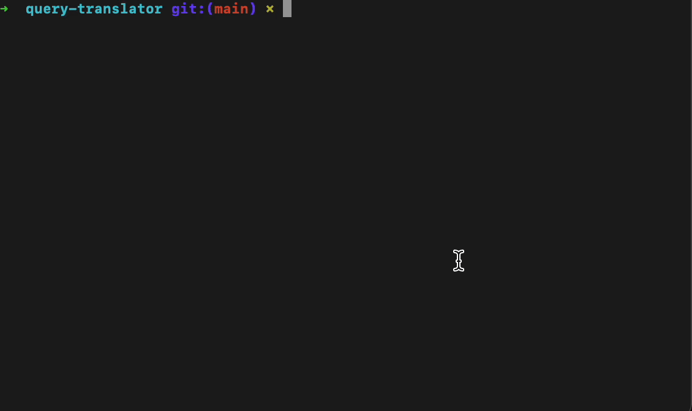

# Query Translator

A very hacked together experiment using [larlpop](https://github.com/lalrpop/lalrpop) to parse query languages into an AST.

Possible use cases:
* Translate a query to a different query language
* Create a generic query UI that can generate queries for multiple data sources
* Extend query languages with UDFs that will be applied to query results in post processing

Translation Example:
SPL <--> AST <--> PromQL

